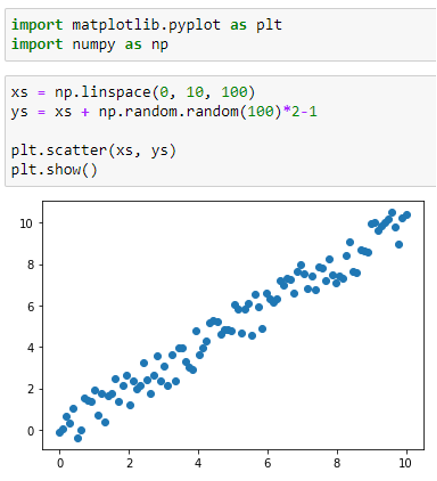
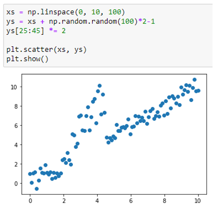

Цель задания
Применить средства автоматизации тестирования python для автоматического тестирования качества работы 
модели машинного обучения на различных датасетах.

ВЫполнено в ноутбуке:
Созданы три датасета с «качественными данными»

[]
На одном из этих датасетов обучена модель линейной регрессии.
Создан датасет с шумом в данных

Из ноутбука записан python-код в py-файл для проведения дальнейшего тестирования с помощью pytest.

Проведено тестирование работы модели на разных датасетах с использованием Pytest, анализируя качество предсказания, 
обнаружена проблема на датасете с шумами.

